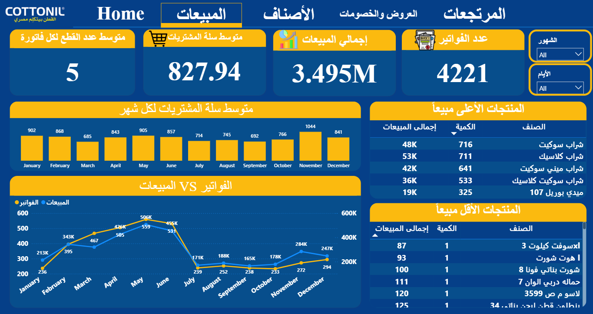

# 📊 Cottonil Sales Analysis | End-to-End Data Project

## 🚀 Overview
This project transforms raw HTML sales reports into a complete data pipeline and interactive dashboard for business decision-making.

---

## 🧩 The Problem
Data existed only in hundreds of unstructured HTML files across multiple folders.

---

## ⚙️ Solution

### 1. Data Extraction
- Python (BeautifulSoup, Pandas)
- Automated scraping for 100+ files
- Handled Arabic RTL & encoding

### 2. Data Cleaning
- Excel + Power Query
- Removed duplicates & cleaned data
- Merged datasets

### 3. Analysis
- Sales trends
- Product performance
- Customer behavior

### 4. Visualization
- Interactive Power BI dashboard

---

## 📸 Dashboard Preview

---

## 📈 Key Insights

- Top 20% products generate most revenue (Pareto)
- Peak sales on Thursdays & Fridays
- Discounts reduce margins
- High return categories identified

---

## 🛠 Tools

Python | Pandas | BeautifulSoup | Excel | Power BI

---

## 📂 Files

- 📄 Report → `reports/`
- 📊 Dashboard → `dashboard/`
- 🐍 Code → `notebooks/`

---

## 💼 Business Impact

- Improved product strategy
- Better inventory decisions
- Data-driven insights

---

## 🔗 Connect
LinkedIn: https://www.linkedin.com/in/samy-alnajy-55bab6343
